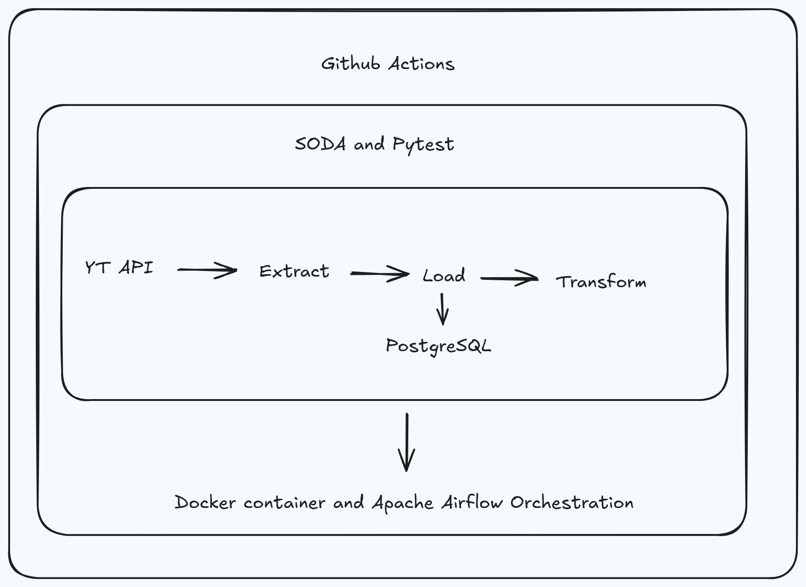

# YT ELT Pipeline

An automated ELT (Extract, Load, Transform) pipeline that pulls video stats from the YouTube Data API for **[Conversas de IT](https://www.youtube.com/@ConversasdeIT)** a Mozambican tech podcast that brings together tech experts from across Mozambique to discuss the industry, careers, and technology. The pipeline extracts video metrics (views, likes, and comments), loads them into a PostgreSQL database, and transforms them  all orchestrated with Apache Airflow, containerised with Docker, and automated with a GitHub Actions CI/CD pipeline.



---

## Architecture

The pipeline is structured in three layers:

- **Extract** — Fetches video stats (views, likes, comments) from the YouTube Data API v3 for the Conversas de IT channel
- **Load** — Loads raw data into a PostgreSQL database
- **Transform** — Transforms and cleans the data within PostgreSQL

**Orchestration** is handled by Apache Airflow using the CeleryExecutor, running inside Docker containers. **Data quality checks** are run with Soda Core. **Unit, integration, and end-to-end tests** are run with Pytest. The full pipeline is automated via **GitHub Actions**.

---

## Tech Stack

| Tool | Purpose |
|---|---|
| Apache Airflow 2.9.2 | Workflow orchestration |
| PostgreSQL 13 | Data storage |
| Redis | Celery message broker |
| Docker & Docker Compose | Containerisation |
| Soda Core | Data quality checks |
| Pytest | Unit & integration testing |
| GitHub Actions | CI/CD pipeline |
| YouTube Data API v3 | Data source |

---

## Project Structure

```
├── .github/
│   └── workflows/
│       └── ci_cd_yt_elt.yaml   # GitHub Actions CI/CD pipeline
├── dags/                        # Airflow DAG definitions
├── docker/
│   └── postgres/
│       └── init-multiple-databases.sh  # Initialises multiple Postgres DBs
├── include/                     # Helper modules and Soda checks
├── tests/                       # Pytest unit and integration tests
├── docker-compose.yaml          # Multi-container Airflow setup
├── Dockerfile                   # Custom Airflow image
├── requirements.txt             # Python dependencies
└── .env                         # Environment variables (not committed)
```

---

## CI/CD Pipeline

The GitHub Actions pipeline has two jobs:

1. **build-and-push-image** Builds the custom Airflow Docker image and pushes it to DockerHub on every push

2.**unit-and-integration-and-e2e-tests**  Spins up the full Docker Compose stack and runs Pytest unit/integration tests and Airflow DAG end-to-end tests

---

## Getting Started

### Prerequisites

- Docker and Docker Compose installed
- A YouTube Data API v3 key ([get one here](https://console.cloud.google.com/))

### 1. Clone the repository

```bash
git clone https://github.com/thiyane24/yt-cdit-elt.git
cd yt-cdit-elt
```

### 2. Create your `.env` file

```bash
cp .env.example .env
```

Fill in the values:

```env
# DockerHub
DOCKERHUB_NAMESPACE=your_namespace
DOCKERHUB_REPOSITORY=your_repo

# Postgres connection
POSTGRES_CONN_USERNAME=postgres
POSTGRES_CONN_PASSWORD=your_password
POSTGRES_CONN_HOST=postgres
POSTGRES_CONN_PORT=5432

# Metadata database
METADATA_DATABASE_NAME=airflow_metadata_db
METADATA_DATABASE_USERNAME=airflow_meta_user
METADATA_DATABASE_PASSWORD=your_password

# Celery backend database
CELERY_BACKEND_NAME=celery_results_db
CELERY_BACKEND_USERNAME=celery_user
CELERY_BACKEND_PASSWORD=your_password

# ELT database
ELT_DATABASE_NAME=elt_db
ELT_DATABASE_USERNAME=yt_api_user
ELT_DATABASE_PASSWORD=your_password

# Airflow
AIRFLOW_UID=50000
AIRFLOW_WWW_USER_USERNAME=airflow
AIRFLOW_WWW_USER_PASSWORD=your_password
FERNET_KEY=your_fernet_key

# YouTube API
API_KEY=your_youtube_api_key
CHANNEL_HANDLE=your_channel_handle
```

To generate a Fernet key:

```bash
python -c "from cryptography.fernet import Fernet; print(Fernet.generate_key().decode())"
```

### 3. Start the stack

```bash
docker compose up -d
```

### 4. Access Airflow

Open [http://localhost:8080](http://localhost:8080) and log in with the credentials set in your `.env`.

### 5. Run tests

```bash
docker exec -t airflow-worker sh -c "pytest tests/ -v"
```

---

## GitHub Actions Setup

To use the CI/CD pipeline, add the following to your GitHub repository secrets and variables:

**Secrets**
- `DOCKERHUB_PASSWORD`
- `AIRFLOW_WWW_USER_USERNAME`
- `AIRFLOW_WWW_USER_PASSWORD`
- `API_KEY`
- `FERNET_KEY`
- `POSTGRES_CONN_USERNAME`
- `POSTGRES_CONN_PASSWORD`
- `METADATA_DATABASE_NAME`, `METADATA_DATABASE_USERNAME`, `METADATA_DATABASE_PASSWORD`
- `CELERY_BACKEND_NAME`, `CELERY_BACKEND_USERNAME`, `CELERY_BACKEND_PASSWORD`
- `ELT_DATABASE_NAME`, `ELT_DATABASE_USERNAME`, `ELT_DATABASE_PASSWORD`

**Variables**
- `DOCKERHUB_USERNAME`
- `DOCKERHUB_NAMESPACE`
- `DOCKERHUB_REPOSITORY`
- `CHANNEL_HANDLE`
- `AIRFLOW_UID`